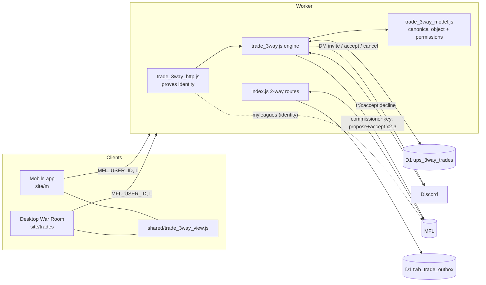
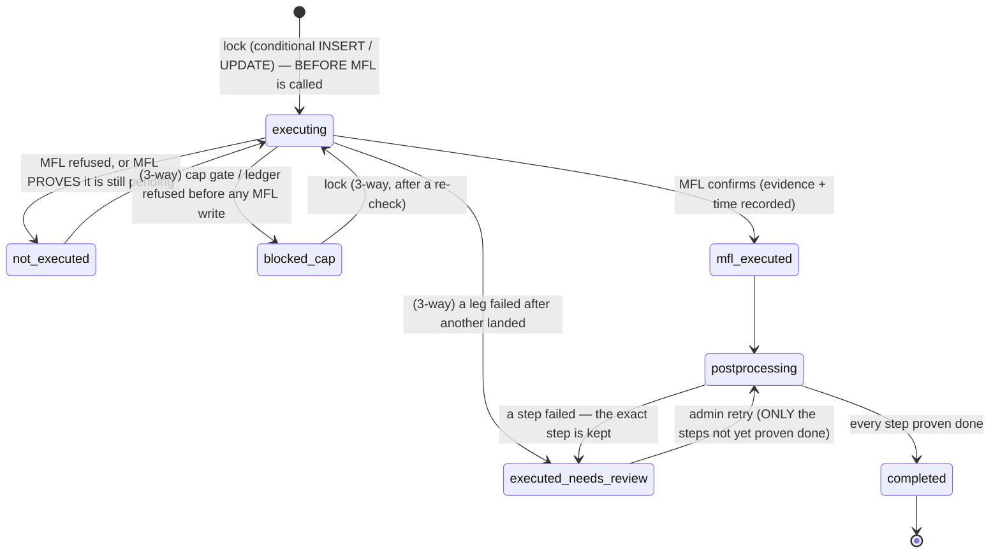

# Trade War Room

**Status:** describes the integration branch `integration/trade-war-room-authz-2026-09-25`, built on a freshly fetched `origin/main` `912d4750a548dcca525d0f1ea58ae8c9b23f4244` — **committed locally only; not pushed, not merged, not deployed.** See §24 for the exact state. Migration `0159` must be applied before the commissioner administrative cancel works (§22).
**Evidence vocabulary (used throughout):** **[verified]** = executed in this session against the real worker code (`worker/src/index.js`), real SQLite/migrations, and either the real client bundles or real production-bundle copies; **[inferred]** = read from code but never exercised; **[unverified in production]** = behavior that depends on live MFL/Discord/D1 state this session did not (and must not) touch. Nothing that is only inferred is described as verified. §25 lists exactly what was and was not proven.
**Authority reminder:** for trades, MFL is authoritative (`pendingTrades`, transactions, rosters, picks); UPS owns only what MFL cannot model — cap-money/extension rules, the 3-way tracker, audit rows (`docs/DATA_AUTHORITY_MAP.md`).

---

## 1. Product purpose and scope

The Trade War Room (TWR) is where owners **build, send, review, counter, accept, decline and revoke trade offers**, with UPS's league-specific rules applied on top of MFL's native trade system: traded cap money (§A6/§E1), pre-trade extensions (§C4), tag/MYM/extension locks, roster and cap validation.

Two kinds of trade exist and behave very differently:

| | 2-way ("offer") | 3-way |
|---|---|---|
| System of record | **MFL** (`tradeProposal` → MFL `pendingTrades`) | **UPS D1** table `ups_3way_trades` until execution |
| Consent | The recipient accepts in MFL/app | **Both partners** accept via a Discord DM button |
| Execution | MFL executes on accept | On both accepts, the worker (commissioner key) runs 2–3 chained MFL 2-party trades |
| Cancel | Offering franchise **revokes** in MFL | **Initiator only** as an owner action. The commissioner has a **separate administrative cancel** (own key, reason required, only while `collecting`; §10) |

MFL only supports 2-party trades, which is why a 3-way is a UPS-side construct (`worker/src/trade_3way.js`).

Out of scope here: trade bait / "On the Block", the trade roast bot's content, extension math internals, the auction.

## 2. Desktop and mobile entry points

| Surface | Entry | Notes |
|---|---|---|
| Desktop (in MFL) | `…/home/74598?MODULE=MESSAGE6=N` (the header's **Trades** link) | `site/trades/mfl_hpm_embed_loader.js` embeds `site/trades/trade_workbench.html` in an iframe; height synced by postMessage |
| Desktop (standalone) | `https://keithcreelman.github.io/upsmflproduction/trades/trade_workbench.html` | needs `?api=`/`?data=` and `MFL_USER_ID`; falls back to `trade_workbench_sample.json` |
| Mobile | `…/m/index.html#league/trade` (League → **Trade**) | PWA; service worker is cache-first on `?v=BUILD` URLs |
| Mobile 3-way detail | `…/m/index.html#league/trade/3w/<tradeId>` | deep-linkable, refresh-safe |
| Desktop 3-way detail | War Room URL with `twb_3w=<tradeId>` (also accepted: `twb_load_offer=<tradeId>` when the id is a UUID) | the loader forwards `twb_3w` |
| Discord | Trade-offer DM deep links `?focus_trade=<mflTradeId>&intent=view\|decline\|counter` (mobile) | consumed and scrubbed by `site/m/app.js` |

## 3. File and component map

### Client
| Path | Role |
|---|---|
| `site/trades/trade_workbench.html` | War Room markup **and inlined CSS** (jsDelivr serves `.html` as text/plain, so external CSS is unreliable in the iframe). `trade_workbench.css` is the source; **any CSS change must be applied to both** |
| `site/trades/trade_workbench.js` | War Room logic (~7.7k lines): board, offer builder, offers banner, 3-way builder, **3-way outbox/detail/cancel** (section "3-WAY TRADES: outbox list + canonical detail + cancel") |
| `site/trades/mfl_hpm_embed_loader.js` | Loads the page in MFL, forwards session + `twb_*` params (`twb_load_offer`, `twb_3w`, `twb_mode`, `twb_left_team`, `twb_right_team`, `twb_side`, `twb_player_id`, `twb_team_id`, `twb_source_team`) |
| `site/m/views/trade.js` | Mobile Trade tab: 2-way inbox, offer builder, 3-way builder, **3-way outbox/detail/cancel** |
| `site/m/views/league.js` | Dispatches `#league/trade[/…]` to `M.tradeView.render(mount, subParts)` |
| `site/m/app.js` | Auth/context: `MFL_USER_ID` capture → `localStorage.ups_mfl_user_id`, `/api/me`, viewer franchise, commissioner "act as" picker (`rdh_my_fid`) |
| **`site/shared/trade_3way_view.js`** | **Shared** 3-way view: response interpretation (`interpretLoad/List/Cancel`), stale-state rule (`preferNewer`), one renderer (`renderDetail/renderCard/renderProblem`), event binding, self-injected CSS. Loaded by both surfaces |
| `site/shared/pretrade_extension.js` | Pre-trade extension eligibility (mobile mirror discipline) |
| `site/rookies/rookie_draft_hub.js` + `mfl_hpm_embed_loader.js` | Draft-day hub: has its own trade dialog (`/api/trade`, `/api/trade/process`, `/api/trades/proposals*`). The loader now forwards the viewer's `MFL_USER_ID` into the hub, which attaches it to those calls (§10, §21) |
| `site/trades/*.json` | Data: `trade_offers_<L>_<yr>.json` (GitHub-mirrored offers), `trade_outbox_*.json` (fallback backend), `extension_previews_2026.json`, `trade_workbench_sample.json` |

### Worker (`worker/src/`)
| Path | Role |
|---|---|
| `index.js` | 2-way routes (`/api/trades/proposals*`, `/trade-offers*`, `/trade-outbox*`, `/trade-pending`, `/trade-workbench`, `/refresh/after-trade`, reconcile), sentinel routes, admin 3-way routes; **delegates** owner 3-way routes to `trade_3way_http.js` |
| **`trade_authz.js`** | **Shared authenticated-caller model** for every owner-facing trade route, 2-way and 3-way (§10, §23) |
| **`trade_3way_http.js`** | Owner-facing 3-way routes: status-code mapping over `trade_authz.js` |
| **`trade_3way.js`** | 3-way engine: create, canonical get/list, cancel, Discord accept/decline, chained MFL execution |
| **`trade_3way_model.js`** | Pure model: state machine, asset-token grammar, canonical builder, permission decisions |
| `trade_dm.js`, `trade_dm_cadence.js` | 2-way offer DMs (day-1, reminders, decline notice), Discord-id resolution, `dmAll` |
| `trade_sentinel.js` | Watches MFL pending offers; invalidates offers whose assets moved |
| `discord_bot.js` | Routes Discord buttons: `tr3:accept\|decline:<id>` (3-way), `tr:think:<id>` (2-way) |
| `feature_flags.js` | Runtime kill switches (D1 `ups_settings.feature_flags` overrides env) |
| **`admin_routes.js`** (generated) · **`admin_front_door.js`** · **`admin_authority.js`** | The exact `/admin/*` route table (`scripts/build_admin_route_table.mjs`, `--check` in the test suite), the classifier (`public` / `admin` / `unknown`), and the credential door (§10a) |
| **`cap_math.js`** · `trade_cap_authority.js` | **The one cap authority** — taxi 0, IR 50 %, known-expired 0, blank ≠ $0 (unresolved), cap money charged to the sender / credited to the receiver. The Front Office roster workbench and the Trade War Room both call it (§14b) |
| **`trade_execution.js`** | The **execution ledger** (`ups_trade_executions`, migration `0160`): states, compare-and-set transitions, lock, post-processing steps, reconciliation matcher (§8a) |
| **`extension_eligibility.js`** | Pure rules that re-prove a pre-trade extension at the accept (§14a) |

### Which code is authoritative
- **3-way:** `trade_3way_model.js` (shape + permissions) → `trade_3way.js` (persistence) → `trade_3way_http.js` (identity). Both clients render only what the server returns. *(Before 2026-09-25 mobile and desktop each had their own view and desktop had none — see §21.)*
- **2-way:** MFL is authoritative; `index.js` proposal/action handlers are the write path. Mobile's builder mirrors the desktop builder ("mirror discipline", `docs/MOBILE_DRIFT_PREVENTION.md`).
- **Stale/duplicated:** the queue-mode/doc-based accept path in `index.js` is unreachable (`directMfl` is hard-coded `true`); `site/trades/README.md` still documents `direct_mfl` as optional; `trade_offers_*.json` offers never leave `PENDING`, so `/admin/trade-offers/pending-ids` is a weak source.

## 4. Architecture and data flow



**3-way lifecycle:** builder → `POST /api/trades/3way` → row `collecting` + invite DMs to both partners → each partner presses Accept/Decline in Discord → both accepted ⇒ `executing` ⇒ legs run ⇒ `completed`/`failed`. The initiator can cancel while `collecting`.

## 5. Canonical trade object (3-way)

Returned by `GET /api/trades/3way?id=` (`{ok, trade}`) and, per item, by the outbox list (`{ok, three_way[], trades[]}`). Built only by `buildCanonical3Way` in `trade_3way_model.js`.

```jsonc
{
  "id": "54a0306a-552e-4f79-8d34-98d72eb704a0",
  "league_id": "74598", "season": "2026",
  "status": "collecting",                 // collecting|executing|completed|failed|cancelled
  "terminal": false,
  "state_view": { "code": "collecting", "label": "Waiting on L.A. Looks & Hawks",
                  "message": "Both partners have to Accept …", "terminal": false, "waiting_on": ["0001","0012"] },
  "participants": [                        // FIXED ORDER: initiator, team_b, team_c — identical for every viewer
    { "slot": "initiator", "fid": "0008", "name": "Real Deal Creel", "name_source": "mfl", "resolved": true, "state": "initiator" },
    { "slot": "team_b",    "fid": "0001", "name": "L.A. Looks",      "name_source": "mfl", "resolved": true, "state": "pending" },
    { "slot": "team_c",    "fid": "0012", "name": "Hawks",           "name_source": "mfl", "resolved": true, "state": "pending" }
  ],
  "movements": [                           // one per (from → to); the stored legs, resolved
    { "index": 0, "from": {"fid":"0008","name":"…"}, "to": {"fid":"0012","name":"…"}, "summary": "…", "cap_k": 0,
      "assets": [ { "token":"P_16614", "kind":"player", "player_id":"16614", "label":"Marvin Harrison Jr.", "position":"WR", "nfl_team":"ARI", "resolved":true },
                  { "token":"FP_0005_2027_1", "kind":"pick", "pick":{"year":2027,"round":1,"slot":null,"original_fid":"0005"}, "label":"2027 1st-round pick (via HammerTime)", "resolved":true } ] },
    { "index": 1, "from": {"fid":"0001",…}, "to": {"fid":"0008",…}, "cap_k": 16,
      "assets": [ {"token":"P_16181","kind":"player",…}, {"token":"BB_16000","kind":"cap","cap_k":16,"label":"$16K cap money","resolved":true} ] }
  ],
  "sides": [ { "fid":"0008", "name":"…", "sends":[{"to":{…},"assets":[…]}], "receives":[{"from":{…},"assets":[…]}], "cap_out_k":0, "cap_in_k":16 }, … ],
  "extensions": [ { "player_id":"…", "player_name":"…", "from_fid":"…", "to_fid":"…", "term":"1YR|2YR", "new_aav_future":…, "contract_info":"…" } ],
  "notes": "", "mfl_trade_ids": [], "executed": false,
  "timestamps": { "created_at_utc": "…", "updated_at_utc": "…", "executed_at_utc": "" },
  "version": "<updated_at_utc>",           // ISO; clients use it to reject stale copies
  "cancelled": null,                       // { by_fid, by_role: initiator|commish|partner|unknown, code: cancelled|declined }
  "permissions": { "can_view": true, "can_cancel": true, "cancel_block_code": "", "cancel_block_reason": "" },
  "integrity": { "ok": true, "issues": [] },   // never silently empty: see §15
  "viewer": { "fid": "0008", "role": "initiator" },  // initiator|partner|commish|none
  "failure_detail": "…"                    // COMMISSIONER ONLY: raw failure_reason
}
```
List/detail responses additionally carry **legacy aliases** (`role`, `can_cancel`, `waiting_on` as names, `initiator_name`, `team_b_name`, `team_c_name`, `team_b_state`, `team_c_state`, `created_at_utc`, per-movement `from_name`/`to_name`) so mobile builds cached by the service worker before 2026-09-25 keep working. Drop them once every client has reloaded.

## 6. Participant and asset representation

- **Participant:** franchise id (4-digit, zero-padded) + name. Names come from MFL's `TYPE=league` export for the season; the stored snapshot on the row is only a fallback (`name_source: "mfl"|"stored"|"missing"`). An unresolved participant is an integrity issue, not a blank.
- **Asset tokens** (built by both builders, translated to MFL form at execution by `toMflAsset`):

| Token | Meaning | MFL token at execution |
|---|---|---|
| `P_<playerId>` | player | `<playerId>` |
| `FP_<origFid>_<year>_<round>` (also `FP_<year>_<round>_<origFid>`) | future pick, keyed by *original* owner | `FP_<origFid>_<year>_<round>` |
| `DP_<year>_<round>_<slot>` | current-year draft pick | `DP_<round-1>_<slot-1>` (0-indexed) |
| `BB_<dollars>` | cap money (BlindBid$) | `BB_<dollars>` |

  Cap money is stored as `cap_k` per movement and injected as a `BB_` token on the giving side at execution (`injectCapTokens`). The canonical object shows it as a `cap` asset.
- **Player names/positions** come from MFL `TYPE=players&PLAYERS=<ids>` (authoritative). If that lookup fails, labels degrade to `Player #<id>` and the trade is flagged (`unresolved_player:<id>`), never dropped.

## 7. D1 schema

### `ups_3way_trades` (migrations `0077`, `0078`, `0079`)
| Column | Notes |
|---|---|
| `id` TEXT PK | UUID |
| `league_id`, `season` TEXT NOT NULL | |
| `status` TEXT NOT NULL DEFAULT `collecting` | CHECK IN (`collecting`,`executing`,`completed`,`failed`,`cancelled`) |
| `initiator_fid`, `team_b_fid`, `team_c_fid` | ring order A, B, C |
| `initiator_name`, `team_b_name`, `team_c_name` | snapshot at creation (fallback only) |
| `legs_json` TEXT NOT NULL | JSON array of movements `{from,to,asset_tokens[],cap_k,summary}` (column predates the free-form model; a pure ring is the 3-movement special case) |
| `team_b_state`, `team_c_state` | CHECK IN (`pending`,`accepted`,`declined`) |
| `initiator_discord_ids`, `team_b_discord_ids`, `team_c_discord_ids` | CSV of linked Discord accounts |
| `mfl_trade1_id`, `mfl_trade2_id`, `mfl_trade_ids` | executed MFL trade ids (`mfl_trade_ids` is the full CSV) |
| `failure_reason` | machine reasons: `cancelled_by_initiator` (owner cancel), `cancelled_by_commissioner` (administrative cancel), legacy `cancelled_by_commish:<fid>` and `cancelled_by_initiator:via_<x>` (rows written by earlier code; still decoded), `declined_by_<fid>`, `dry_run`, `PARTIAL_…`, `lockout_…` |
| `cancel_basis`, `cancelled_by`, `cancel_reason`, `cancelled_at_utc` | **migration `0159`** (four nullable, additive columns). Written only by the commissioner administrative cancel, in the same conditional `UPDATE … WHERE status='collecting'` that changes the status: basis `cancelled_by_commissioner`, actor `commissioner_admin`, the required reason (≤500 chars), ISO timestamp. Owner cancels leave them NULL |
| `notes`, `extension_requests_json` | initiator note; pre-trade extension requests |
| `created_at_utc`, `updated_at_utc`, `executed_at_utc` | ISO timestamps; `updated_at_utc` is the canonical `version` |

Indexes: `idx_3way_status(status)`, `idx_3way_league(league_id, season, status)`. **No migration was added by the 2026-09-25 fix** (rollback needs no schema step).

### Other trade tables (2-way and support)
| Table | Purpose | Written by |
|---|---|---|
| `twb_trade_outbox` | Audit of every offer submit/accept: payload, hash, MFL response snippets, status `PENDING→POSTED→VERIFIED\|FAILED`. **Created at runtime by `ensureOutboxTable` — there is no migration file** | proposal/action handlers |
| `trade_offer_dm` (`0076`, `0102`) | Per-offer DM cadence: `state active\|resolved\|ended`, `resolved_reason`, `track main\|thinking`, `extended`, `reoffer_pending`, `dm_message_ids` | `enqueueTradeOfferDm`, hourly sweep, Think button, live reconcile |
| `ups_trade_offer_watch` (`0102`) | Sentinel mirror of MFL pending offers; `lifecycle`, `expires_unix`, `act_log` | sentinel tick |
| `ups_transactions` (`0075`) | `type='TRADE'` ledger rows | */5 ledger scan |
| `src_trades` | Historical trades (ETL) | Python ETL |
| `ups_trade_outcomes` (`0152/0153/0155`) | Post-hoc trade outcome stats | manual `sync_trade_outcomes_to_d1.py` |
| `discord_owners` | franchise ↔ Discord user ids used for DMs | out of scope |
| `ups_settings` (`feature_flags`) | runtime overrides for env flags | Commish Settings |

## 8. Trade state machine

### 3-way (persisted, `STATE_MACHINE` in `trade_3way_model.js`)

```mermaid
stateDiagram-v2
  [*] --> collecting: POST /api/trades/3way (initiator)
  collecting --> executing: both partners Accept (Discord)
  collecting --> cancelled: initiator cancel (or commissioner acting as initiator) · partner Decline
  executing --> collecting: the cap gate (or the ledger) refused BEFORE any MFL write — ledger state `blocked_cap`, both accepts kept
  collecting --> executing: re-check / commissioner retry finds the cap now allows it
  executing --> completed: all MFL legs landed (or dry-run)
  executing --> failed: a leg failed (before anything landed = safe; after one landed = ledger `executed_needs_review`)
  failed --> executing: commish /admin/3way/retry (only if no leg landed)
  completed --> [*]
  cancelled --> [*]
```

The persisted `status` column is constrained to those five values (a CHECK from migration `0077`), so the **finer states live in the execution ledger** (§8a) and are merged into the canonical trade (`state_view.code` = `blocked_cap` / `executed_needs_review`, plus `execution`).
Every transition out of `collecting` is a **conditional `UPDATE … WHERE status='collecting'`** and is honored only if it changed a row (this closed two races, §21).

| State | Who can view | Who can cancel | Accept / decline | Load (mobile / desktop) | Terminal |
|---|---|---|---|---|---|
| `collecting` | initiator, both partners, commissioner | **initiator only** (the commissioner cancels through the separate administrative action, `POST /admin/3way/cancel`) | partners, via Discord DM only | yes / yes | no |
| `executing` | same | **nobody** (409 `cannot_cancel_executing`) | — | yes / yes | no |
| `completed` (incl. dry-run) | same | nobody (409) | — | yes / yes (view-only) | yes |
| `failed` | same (raw reason: commissioner only) | nobody (409); commissioner may retry | — | yes / yes (view-only) | yes |
| `cancelled` | same | already cancelled → idempotent 200 | — | yes / yes (view-only) | yes |

"Draft" and "Superseded" do not exist server-side for 3-ways: the builder state is in-memory in the client, and a 3-way cannot be countered or edited — cancel and start a new one.

### 8a. Irreversible execution — the ledger (`worker/src/trade_execution.js`, table `ups_trade_executions`, migration `0160`) **[verified — `tests/trade_execution_state.test.mjs`, 15 tests / 188 assertions]**

MFL accepting a trade cannot be undone, so "did MFL execute it?" is a **structural fact recorded before and after the call**, not something inferred from whether the rest of the request succeeded.


| Guarantee | How |
|---|---|
| MFL is called **at most once** per trade | the lock is a conditional write; a concurrent, repeated or retried accept cannot obtain it (`execution_in_progress` / `already_executed`). If the ledger is unavailable the accept fails closed **before** MFL. |
| MFL success is **permanent** | `mfl_executed` and everything after it are MFL-done states; the transition table has **no** edge back to `executing`, `not_executed` or `blocked_cap`. Evidence (`mfl_evidence_json`) and the time are kept. An executed trade never re-enters a normal pending state (`tests/trade_execution_state`). |
| Post-processing only after MFL executed | cap-money adjustments, pre-trade extensions, taxi sync run after `mfl_executed`; each step's result is recorded in `steps_json`. A taxi move MFL does not **confirm in its rosters export** is a failed step (`executed_needs_review`, `failed_step: taxi`), never `completed`; the commissioner and the receiving owner get one DM (2026-10-07, #1249). |
| A failed extension is **not** "not executed" | the accept answers `200 executed:true, needs_review:true, failed_step`, the offer is never reported as failed, MFL is never retried, and only that step can be re-run. |
| Retry = post-processing **only** | `POST /admin/trade/postprocess-retry` re-runs the steps not yet proven done; the cap-money step first checks MFL for its rows so it can never post twice. An earlier extension whose import **reached MFL but could not be verified** is refused (`manual_verification_required`) — re-applying blind could extend twice; `force` after a human check. A three-way whose *legs* partly failed (`legs_need_manual_fix`) cannot be retried. |
| A lost response is settled by **asking MFL**, never by calling it again | on a failed/timed-out accept the worker reads MFL's `transactions` (the trade is listed only if it executed — proof) and then `pendingTrades` (still pending — proof it did not). Neither ⇒ `503 execution_unconfirmed`, the lock stays, nothing is re-sent. A repeat accept and `POST /admin/trade/reconcile-execution` reuse the same check. |
| D1 failing **after** MFL succeeded is recoverable | the accept still reports `executed:true, execution_persisted:false`; the ledger row stays `executing` (never `not_executed`); reconciliation finds the trade in MFL's ledger and completes the record. |
| The owner is told the truth | three different messages: *executed* · *executed, but its contract/extension processing needs commissioner review (nothing for you to redo)* · *not confirmed — and never sent twice*; shared reading `interpretAction` (mobile toast, desktop modal). |

Admin routes (all behind the door in §10a **and** an explicit commissioner key; none can send a trade to MFL): `GET /admin/trade/execution?id=` (row; never the lock token or payload) · `POST /admin/trade/postprocess-retry {id, kind?, force?}` · `POST /admin/trade/reconcile-execution {id}` · `GET /admin/release-info` (exact release marker; the deployment discriminator).

### 8b. Three-team cap blocks are recoverable (`blocked_cap`) **[verified — `tests/trade_cap_gate.test.mjs` 3-WAY cases, 37 tests / 524 assertions]**
A trade both partners accepted whose post-trade cap is over (or cannot be verified — `cap_check_unavailable`) is **never** marked `failed`:
- a partner's accept is **recorded regardless** of the cap verdict (the cap is reported, not used to discard consent) — except a *stale pre-trade extension*, which is refused at the accept because it can never run as built;
- when the last accept arrives and the execute-time gate blocks, the row goes back to `collecting`, both approvals are preserved, the ledger says `blocked_cap` with the blocking franchise(s) and amount(s), **zero** MFL writes and **zero** completed-state writes occur, and all three owners are told **once** per distinct block;
- the cap is recomputed **from scratch on every retry** (`POST /api/trades/3way/recheck`, or the commissioner retry); the moment it is legitimately fine the trade runs;
- owners cannot cancel it (canon A6: nobody can cancel once all three accepted); the commissioner's administrative cancel is the exit;
- `failed` is reserved for terminal, admin-reviewed failures (MFL refused a leg with nothing landed, a lockout, partial legs).

### 2-way
| Concept | Reality |
|---|---|
| Draft | client-only: desktop persists builder state in `localStorage` (`ups-trade-workbench-state-v9:<L>:<yr>:<route>`); mobile builder is in-memory |
| Submitted / open | MFL `pendingTrades` entry (plus outbox row `POSTED`/`VERIFIED` and a `trade_offer_dm` row) |
| Countered / superseded | counter = `reject` the old trade + `tradeProposal` a new one (`COUNTER` action); no server-side link between the two other than outbox rows |
| Accepted | MFL `tradeResponse accept`; worker then applies salary adjustments/extensions and verifies |
| Rejected | MFL `tradeResponse reject` (decline notice DM to offerer) |
| Cancelled / withdrawn | MFL `tradeResponse revoke` by the offering franchise |
| Expired | MFL's own pending-trade lifetime (the worker assumes 7 days, `TRADE_DM_EXPIRY_DAYS`); DM rows resolve to `expired`; the sentinel's "re-offer to reach 14 days" is **not implemented** (dry-run only) |
| Failed | outbox `FAILED`; no separate user-visible state |

## 9. API endpoint table

`L` = league id. **`MFL_USER_ID`** (query param on mobile/desktop, or real cookie) is the session. All responses include `Access-Control-Allow-Origin: *`.

### 3-way owner routes (`trade_3way_http.js`; exempt from the global "Missing L param" guard by **exact path match**)
League: `L` if sent, else the worker's configured league; a `league_id` in the body must equal it (400 `league_mismatch`). Season: `YEAR`/`season`, else the worker's current season. **Every trade is scoped to that (league, season)**; a trade from another league or season is indistinguishable from a missing one (404) — even for the commissioner.

| Method + path | Auth | Success | Errors |
|---|---|---|---|
| `GET /api/trades/3way?id=<uuid>` | proven session (or admin key); participant, or commissioner | 200 `{ok, trade}` (any status, incl. terminal) | 400 `bad_request` · 401 `unauthenticated`/`session_expired` · 403 `forbidden` · 404 `not_found` · 503 `unavailable`/`identity_unavailable` |
| `GET /api/trades/3way[?franchise_id=][&include=all]` | proven session; own franchise only (commissioner: any) | 200 `{ok, three_way[], trades[]}` (active only unless `include=all`; this season; max 25) | same; 403 if another franchise's list |
| `POST /api/trades/3way` | proven session; `initiator.fid` must equal the proven franchise | 201 `{ok, id}` | 400 (friendly message + `code`), 401, 403 |
| `POST /api/trades/3way/cancel` body `{id}` | proven session; **the initiator's own session only** (a commissioner session or the admin key acting *as* the initiator is refused: 403 `commissioner_use_admin_action`) | 200 `{ok, code:"cancelled"\|"already_cancelled", already, trade}` | 401, 403 `forbidden`/`only_initiator_can_cancel`/`commissioner_use_admin_action`, 404, **409 `cannot_cancel_<status>`** (with canonical `trade`), 503 |
| `POST /admin/3way/cancel` body `{id, reason}` (`&L=` required) | **`COMMISH_API_KEY` only** (constant-time compare; no cookie, no acting-as, no impersonation) | 200 `{ok, code:"cancelled"\|"already_cancelled", already, trade}` | 400 `reason_required`, 401/403 (missing/wrong key), 404, **409 `cannot_cancel_<status>`** (executing/completed/failed/expired/already cancelled by the owner), **503 `migration_required`** until `0159` is applied |

Optional `acting_franchise_id` (query or body; a legacy cancel body `franchise_id` counts the same) is an *"act as" request*, honored only for a proven commissioner. Error body shape: `{ok:false, code, error, message}`; `error` is owner-safe text, never a stack or SQL.

**Route audit (all `/api/trades/3way*` — every row below is exercised by `tests/trade_3way_routes.test.mjs` through the real worker):**

| Route | Method | Requires league | League resolved from | Requires session | Identity authority | Participant check | Failure status |
|---|---|---|---|---|---|---|---|
| `/api/trades/3way` (detail `?id=`) | GET | yes | `L` else worker default; body league must match | yes (or admin key) | proven MFL session via `myleagues` | participant or commissioner | 400/401/403/404/503 |
| `/api/trades/3way` (list) | GET | yes | same | yes | same | own franchise (commissioner any) | 400/401/403/503 |
| `/api/trades/3way` | POST | yes | same | yes | same | body `initiator.fid` = proven fid | 400/401/403 |
| `/api/trades/3way/cancel` | POST | yes | same | yes | same | initiator only (§10) | 400/401/403/404/409/503 |

Required cases **[verified]**: missing `L` (falls back to the worker league — the deployed mobile shape), invalid `L` (garbage / SQL-ish / other league → 400/403), missing session (401), invalid session (401), MFL identity outage (503), nonparticipant (403, no data), participant, commissioner (view yes / administrative cancel no), cross-league trade id (404), other-season trade id (404), malformed UUID (400/404), missing trade (404), terminal trade (409, still viewable). **No 3-way endpoint trusts a body `franchise_id` as identity.**

**Global-guard exemption cannot fail open [verified]:** the exemption is two exact-path comparisons (`/api/trades/3way`, `/api/trades/3way/cancel`); look-alikes (`/api/trades/3way/`, `/…/other`, `/…/cancel/x`, `/api/trades/3wayx`) still get `400 Missing L param`; and every route exempted from the guard (3-way, proposals, outbox, reconcile, refresh-after-trade) refuses an unauthenticated call with 400/401/403/503 and changes nothing.

### 3-way admin routes (commissioner `APIKEY`, unchanged)
`GET /admin/3way/inspect` (any status + `failure_reason`; `&pending=1` adds live MFL pending) · `POST /admin/3way/retry` (only `failed` rows with no landed leg) · `POST /admin/3way/apply-extensions` and `POST /admin/3way/compliance` (internal, via `env.SELF`; compliance is read-only) · **new:** `GET /admin/trade/execution` · `POST /admin/trade/postprocess-retry` · `POST /admin/trade/reconcile-execution` · `GET /admin/release-info` (§8a). Owner route added: `POST /api/trades/3way/recheck {id}` (re-check a cap-held trade; participants or commissioner; the server re-verifies everything).

### 2-way and shared routes (`index.js`) — **authorization changed 2026-09-25 (§10)**
Legacy aliases share one handler with their `/api/trades/*` twin (`/trade-offers` = `/api/trades/proposals`, `/trade-offers/action` = `…/proposals/action`, `/trade-outbox[/replay]` = `/api/trades/outbox[/replay]`, `/reconcile/extensions`, `/refresh/after-trade`); both spellings are gated identically **[verified]**.

| Route | Purpose | Authority now |
|---|---|---|
| `GET /api/trades/proposals` (+ `/trade-offers`) | live pending trades from MFL for the viewer → `incoming`, `outgoing` | owner session (unchanged; already fail-closed: 401 `missing_owner_session…`) |
| `GET /api/trades/proposals/<id>` | one pending offer | owner session |
| `POST /api/trades/proposals` | submit an offer to MFL (+ outbox, + GitHub offers doc, + day-1 DM) | **proven session; `from_franchise_id` must be the proven franchise** (commissioner may act as another team through their own session) |
| `POST /api/trades/proposals/action` | `accept` / `reject` / `revoke` / `counter` / **`preview`** | **proven session** + `verifyTradeParty` (originator revokes; recipient accepts/rejects/previews; a counter must go back to the offerer). **`accept` is an action request only:** authority is MFL's pending row + the stored outbox row, client content is compared and ignored, and the live **salary cap is a hard block** before MFL is called (*2-way accept integrity*). **`preview`** is the read-only review the clients show before the confirmation (same checks, same calculation; writes nothing) |
| `GET /trade-pending` | raw MFL `pendingTrades` for the viewer | owner session (unchanged) |
| *(read routes above)* | `/api/trades/proposals`, `/trade-offers`, `/trade-pending` | an expired or invalid MFL session now returns **401 `session_expired`** (it used to be 502, which looked like an outage). Clients also accept the legacy 502 with upstream 401 |
| `POST /admin/3way/compliance` (internal) | `COMMISH_API_KEY` only (called by the 3-way engine through `env.SELF`) | the same cap + roster calculation for a 3-way's movements + pre-trade extensions; read-only. An OLD worker answers `200` with its generic admin-state JSON for any unknown `/admin/*` path; the new one answers `403` without the key |
| `GET /api/trades/outbox`, `POST …/outbox/replay` | outbox lookup / re-run salary+extension imports | lookup: **proven caller; an owner sees only rows for their team**; replay: **admin key or commissioner session only** |
| `GET\|POST /api/trades/reconcile/extensions` | retry FAILED/POSTED extension rows | **admin key or commissioner session only** |
| `GET\|POST /api/trades/refresh-after-trade` | clear workbench caches, re-export league state | **proven league member or admin key** (it internally calls reconcile with in-process admin authority via `env.SELF`) |
| `GET /trade-workbench` | War Room data payload (45 s edge cache; `NO_CACHE=1` bypass) | unchanged (read-only data) |
| `POST /api/trade` | one-shot propose helper (the rookie hub) | `simulate` stays open; **a live proposal needs a proven caller who is the `from` team** |
| `POST /api/trade/process` | commissioner one-shot propose+accept | **admin key or commissioner session only** — a body `requested_by` is **no longer authority** |
| `POST /admin/trade-sentinel/tick`, `…/test-battery`, `GET /admin/trade-offers/pending-ids` | commissioner tools | `APIKEY` (unchanged) |

## 10. Authentication and authorization

**One caller model for every owner-facing trade route** (`worker/src/trade_authz.js`, `resolveTradeCaller`) — used by the 3-way handler *and* the 2-way handlers. Two **separate** authorities, deliberately never merged into a fallback chain:

| Authority | Proof | Carries | Used for |
|---|---|---|---|
| **Owner** | an MFL session (`MFL_USER_ID`) proven against MFL `TYPE=myleagues` (`_rdhDetectFranchise`) | a franchise id, and whether that franchise is a commissioner (`COMMISH_FRANCHISE_IDS`, default `0008,0000`) | every owner action |
| **Admin** | `COMMISH_API_KEY` presented as `APIKEY` (constant-time compare) | **no franchise** — it must *name* the team it acts for | replay, reconcile, `/api/trade/process`, automation |

A franchise id in a body/query (`franchise_id`, `acting_franchise_id`, `from_franchise_id`, `requested_by`) is **only a claim of who to act as**. It is honored for a proven commissioner (MFL itself lets a commissioner session pass `FRANCHISE_ID`) and refused (403 `forbidden`) for anyone else. **There is no path from "no credentials" to the worker's own commissioner cookie (`env.MFL_COOKIE`)** — that fallback (`viewerCookieHeader = browser cookie || env.MFL_COOKIE`) was removed from every owner write. Keith 2026-05-28: *"trades are always owner-to-owner; the commissioner cookie is never an acceptable substitute for an owner's session."*

| Situation | Result |
|---|---|
| No token | 401 `unauthenticated` |
| Token MFL rejects (HTTP 401/403) | 401 `session_expired` |
| Token valid but not a member of the league | 403 `forbidden` |
| MFL unreachable while verifying | 503 `identity_unavailable` (**fail closed**) |
| `APIKEY` wrong | 403 `forbidden` |
| `APIKEY` right, on an owner route with no `acting_franchise_id` | cannot act (no franchise) |
| Body franchise ≠ proven franchise, caller not commissioner | 403 `forbidden` |
| `league_id` in body ≠ resolved league | 400 `league_mismatch` |

### 10a. Admin-route front door **[verified — `tests/admin_route_security.test.mjs`, 15 tests / 1,800 assertions]**
**Root cause (production, measured 2026-09-25, read-only):** the worker's last line answered *every unmatched path* with `adminStateResponse()` — and that helper decided "is the caller an admin?" from `getLeagueAdminState()`, which reads **the worker's own stored commissioner cookie**, so it said "admin" for everyone. An anonymous `GET /admin/<anything>` returned `200` with `isAdmin:true`, the commissioner franchise id and the owner-email count; ~100 real admin routes shared the same "worker is a commissioner" check.
**Fix:** the route table (`admin_routes.js`, generated from the source by `scripts/build_admin_route_table.mjs`, drift-checked in the suite: 108 entries incl. the new execution routes) is matched **exactly** before any handler runs.

| Request | Answer |
|---|---|
| unrecognized `/admin/*` (unknown, nested, trailing slash, duplicate slash, case, encoded separators) | uniform `404 {"ok":false,"error":"not_found"}` — no route inventory, no state (dot segments are resolved by the URL layer before the worker, then fall on the exact route) |
| recognized route, **wrong method** | the same uniform `404` (a route's methods are part of its identity) |
| recognized non-public route, **no** credential | `401 {"ok":false,"code":"unauthenticated"}` |
| recognized route, a **wrong** credential | `403 {"ok":false,"code":"forbidden"}` |
| recognized route, a valid credential (`COMMISH_API_KEY` / `TEST_SYNC_API_KEY` / `MFL_APIKEY` as `APIKEY`, `key`, `X-COMMISH-APIKEY`, `X-MFL-APIKEY`, `X-Internal-Auth`, or an MFL session **MFL proves** belongs to a commissioner franchise) | the route runs (each may add a stricter rule of its own) |
| `OPTIONS` (real or unknown admin path) | the minimum CORS answer, no data |
| **any** unauthorized answer | never contains the commissioner franchise id, an owner-email count, owner identities, admin configuration, a route list, migration state or operational metadata (`NO LEAK` test) |
| unmatched **non-admin** path | the same uniform `404` — there is no generic fall-through anywhere |

Deliberately public (unchanged, GET only, free of protected fields): `/admin/contract-submissions`, and the Front Office widget's `/roster-workbench/admin-state` — which now answers an anonymous caller with a bare "not signed in", gives a proven member session/key the franchise id, and **never** returns an email count. A regression test reproduces the base worker (`912d4750`, extracted with `git archive`) answering `200` with the commissioner state for an unknown admin route, and asserts the fixed worker answers `404`.

### Final cancellation-permission matrix **[verified]** (`decideCancel`; `tests/trade_3way_{engine,routes}` and `trade_2way_authz`)

| Actor | 3-way `POST …/3way/cancel` | 2-way `…/proposals/action` `revoke` |
|---|---|---|
| **Initiator / originator** | allowed while `collecting` (200); repeat → 200 `already_cancelled`; `executing`/`completed`/`failed` → 409 | allowed (MFL: only the originator may revoke) |
| **Other participant / recipient** | 403 `only_initiator_can_cancel` (partners **decline in the Discord DM**, which also cancels) | 403 (recipient may `reject`/`accept`, never `revoke`) |
| **Commissioner, administratively** (`POST /admin/3way/cancel`, `COMMISH_API_KEY`, non-empty reason) | allowed **only while `collecting`**; records `cancelled_by_commissioner` + reason + timestamp; DMs all three owners once; **no MFL execution**; a repeat is `already_cancelled` with no second DM | not permitted (MFL rule: revoke only by originator) |
| **Commissioner session / admin key on the owner route** (acting as the initiator) | **refused** 403 `commissioner_use_admin_action` — the administrative cancel is a distinct action, never an owner cancel in disguise | allowed through the commissioner's **own** session (`FRANCHISE_ID`), subject to MFL's commissioner **lockout** (which blocks it) |
| **Admin key** | only through `/admin/3way/cancel` (reason required); the owner route refuses it | must name the acting team |
| **Unrelated authenticated franchise** | 403 `forbidden` (never reveals status); 404 if the trade is another league/season | 409 `offer_not_pending` (MFL scopes `pendingTrades` to the cookie, so they cannot see it) |
| **Unauthenticated** | 401 | 401 |

> **Ruling recorded 2026-09-25 (Keith), canon `docs/league_context_v1.md` §A6.** Owner cancel of a three-team trade stays initiator-only; other participants cannot cancel. The commissioner may cancel administratively, as a distinct action, only while the trade is `collecting`, with a non-empty reason, using the commissioner API key. It is recorded as a commissioner/admin cancel (`cancelled_by_commissioner`, reason, timestamp), notifies all three owners exactly once, is idempotent, executes nothing in MFL, and never applies to `executing`/`completed`/`failed`/`expired`/already-cancelled trades. Implemented in `decideAdminCancel` (`worker/src/trade_3way_model.js`) and `adminCancel3WayTrade` (`worker/src/trade_3way.js`); direct tests in `tests/trade_3way_admin_cancel.test.mjs` (26 tests / 264 assertions).

### 2-way accept integrity **[verified — `tests/trade_2way_accept_integrity.test.mjs`, 40 tests / 376 assertions]**

The accept request is an **action request only**. Nothing the client sends can change what is executed.

1. **Authority.** The pending trade is loaded from MFL `pendingTrades` **as the acting owner**; if it cannot be loaded or is not addressed to the caller the request fails closed (503 / 409). The stored `SUBMIT` row in `twb_trade_outbox` (looked up by league, season and MFL trade id) is used **only if its assets bind exactly** to the MFL `will_give_up` / `will_receive` tokens; otherwise the payload is rebuilt from MFL's tokens (no extensions). A stored row whose extensions cannot be verified is refused (`stored_offer_mismatch`).
2. **Client payload.** The client's payload, extension requests, meta and MFL csv claims are discarded. They are compared with the authoritative payload on **identity fields only** (assets per franchise, cap money, direction, extension identity, payload hash); display fields (names, labels, salary strings) are ignored. A difference is refused 409 `payload_mismatch` — nothing is executed and nothing is written.
3. **Revalidation at action time** (every accept): players and future picks are still owned by the sending franchise; current-year picks are still owned (draft results); round-6 picks and picks beyond year+1 are not tradeable; traded cap money is ≤ 50 % of non-taxi salary sent and needs a non-salary asset (`BB_` tokens are dollars); extension requests still pass the eligibility preflight. Refusals: 409 `asset_ownership_mismatch` / `pick_not_tradeable` / `cap_money_rule` / `extension_no_longer_eligible`.
4. **Replay, counters, concurrency.** A counter or revision rejects the old pending trade, so a stale accept finds nothing pending (409). Two concurrent accepts cannot execute two payloads: MFL accepts one pending id once and the loser is refused. A failure before or during the MFL write leaves no completed state; a retry after a lost response is safe (the trade is no longer pending, so the retry cannot re-execute). **From the final gate the guarantee is structural:** the execution lock is taken before MFL is called and MFL's answer — or, when it is lost, MFL's own ledger — decides the outcome (§8a).
5. **The post-trade salary cap is a HARD block; roster counts are advisory (ruling 2026-09-25) [verified — `tests/trade_cap_gate.test.mjs`].** After every other check and **before MFL is called**, the worker recomputes each team's cap from live MFL exports read at that moment: `rosters` (current-year salary, status, contract fields), `salaryAdjustments` (every adjustment: drop penalties/dead money, earlier trade cap money, manual entries) and `league` (`auctionStartAmount`, else `salaryCapAmount`). One rule, `worker/src/trade_cap_authority.js`, identical to the Front Office roster workbench's `currentCapHit` + adjustments: taxi = 0, injured reserve = 50%, a *known*-expired contract = 0, otherwise the salary MFL holds — the **current-year** amount, so a loaded / front-loaded contract counts what it costs this year, not its average. Post-trade a team drops what it sends, takes on what it receives (landing as ROSTER at full current-year salary — or the extended year-1 salary when an accepted pre-trade extension resets it. **A player coming off the other team's taxi squad lands at full salary too:** MFL puts every traded player on the active roster, and under lockout nothing can move him back at that moment, so the cap check and the roster count never assume a later taxi move — 2026-10-07, #1249; such players are listed in the roster row's `taxi_arrivals`), and settles cap money (**sender charged +amount, receiver credited −amount**, exactly the salaryAdjustment rows the worker posts after an accept). **Over the cap by any amount** → 409 `cap_exceeded` naming the franchise and the amount; **exactly at the cap passes**; **an unreadable, failed or malformed input — including a blank roster salary (blank ≠ $0) or an adjustments export with the wrong shape — → 503 `cap_check_unavailable`**. Both happen before any MFL write and leave the offer pending with nothing recorded. Client cap totals, `cap_ok` flags and override fields are never read; there is no owner or commissioner override. `compliance` (per-team used-before/after/room and the advisory roster projection) comes back on success and from `action: "PREVIEW"`.
   - **Roster maximum and five active QBs (HARD, Keith 2026-10-07) [verified — `tests/trade_roster_qb_gates.test.mjs`, `tests/trade_roster_qb_routes.test.mjs`].** `compliance.roster_limit` warns at SEND (Offer Review notice, never a Send block) and refuses an ACCEPT (409 `roster_room_required`, 503 if unreadable) when any team would be over MFL's `rosterSize` after the arriving-taxi moves **the executing engine's own taxi step** will make. Only the two-team accept has that step (`applyTaxiDemotionsFromPayload`: moves the offer's taxi-flagged players, verifies against MFL's rosters, needs-review + owner/commissioner DM on failure), so only it passes `taxiStep: { pids }` to `evaluateTradeCompliance`; the Send preview passes the offer's taxi-flagged ids (`taxi_step_player_ids`) for a two-team offer only. A credited player must also be on the sender's TAXI squad, taxi-eligible for the receiver right now (`worker/src/trade_taxi_destination.js`: UPS R2+, inside 3 league years, Rookie-Draft contract, < 4 call-ups across teams, didn't finish a prior season active, game not started) and fit in the receiver's open taxi spots. **3-way has no taxi step** (`/admin/3way/compliance` never passes `taxiStep`): every arrival counts active (`taxi_not_credited` reason `no_taxi_step`). Any other move must be made first. Rows carry `active_after` (actual — what MFL shows), `active_after_taxi` and `moves_needed`. `compliance.qb_limit` refuses SEND and ACCEPT (409 `qb_limit_exceeded`) when a team would have more than 5 ACTIVE QBs **right after MFL executes**. There is no taxi credit for an arriving QB, and QBs already on taxi or IR are excluded. **In-season only** (`worker/src/qb_trade_window.js`):
  - the window runs from the league's configured September contract deadline (2026: 09-06 23:59 ET; else 23:59 ET on the last Sunday before NFL Week 1) to the last NFL Week-17 kickoff + 4 h;
  - outside it, `status` is `not_applicable` (executable);
  - an unestablished window is `unavailable` (Accept refused, 503);
  - the window never reads MFL's position limits;
  - the MFL-site check sends QB alerts in-season only. The cap is always the actual liability. The 27 minimum stays a heads-up (`compliance.roster`). 3-way uses the same gates (`kind` `roster_room_required` / `qb_limit_exceeded`, recoverable). Trades accepted on MFL's own site: `POST /admin/trades/roster-check` (5-min cron, flag `TRADE_ROSTER_CHECK_ENABLED`, ships OFF; migration `0168`) DMs the affected owner + commissioner with counts, the move and the deadline (24 h or the team's next player lock), and sends ONE commissioner escalation after it; never drops, voids or penalizes. **One alert per team and limit** while it stays over, however many trades are involved; the alert closes once MFL shows the team back within the limit, and a trade from before that can't start or block a new one. A War Room trade is skipped when both its teams are participants of a ledger execution within 3 minutes of its stamp, or for a 3-way up to 15 minutes before it (the stamp follows its last leg). A `sending` claim older than 15 minutes is retried; an escalation is claimed before it is sent. If the owner can't be reached, the commissioner's copy says so. `dry_run` is read-only end to end (no heartbeat, claim table or DM) and may replay up to 14 days (`window_hours`, `since`). MFL itself (verified in test league 25625): a single taxi or IR request that leaves a team over the maximum is refused; one request ending at or under it passes.
   - **Three-team:** the same calculation, through the internal `/admin/3way/compliance` route. A Discord Accept is **recorded** whatever the cap says (consent is preserved) and the reply carries the cap warning; a *stale pre-trade extension* is the one exception — it is refused at the accept (the ephemeral reply says so) because it can never run as built. When the last accept arrives, `execute3Way` re-runs the gate **before any MFL call and before any completed-state write**: an over-the-cap or unverifiable result puts the trade back to `collecting` with **both approvals kept**, ledger state `blocked_cap`, the blocking franchise and amount recorded, all three owners told once (§8b). A re-check (`POST /api/trades/3way/recheck` or the commissioner retry) recomputes from scratch and runs it the moment the cap allows. The canonical detail of a live 3-way carries the projection for both surfaces.
   - **Pre-trade extensions at accept** use one planner (`planExtensionSalaries`) backed by `extension_eligibility.js`: the request must still plan cleanly **and** pass every rule in §14a (current owner, final year, tag / ERA locks, September deadline and four-week window, extension and restructure history, live salary anchoring, exact league/season), reading its authorities at that moment and failing closed when one is unreadable.
6. **Tamper matrix covered** (mobile and desktop request shapes): swapped, added or removed player; swapped or added pick; changed salary, contract, cap money or direction; forged extension request; forged MFL csv; wrong payload hash; wrong outbox id; wrong franchise; another league/season; stale row after a revision.


### 2-way route authorization — before and after **[verified against pristine `origin/main` `912d4750` and the integration tree]**

| | `origin/main` `912d4750` (before) | integration tree (after) |
|---|---|---|
| `POST /api/trades/proposals` with **no session** | **201 — offer created in MFL with the commissioner cookie, impersonating the body's franchise** | 401 `unauthenticated`, nothing written |
| `POST …/proposals/action` (`revoke`) with no session, naming another team | **200 — revoked with the commissioner cookie** | 401 |
| body `from_franchise_id` ≠ session | accepted | 403 `forbidden` |
| `GET /api/trades/outbox` signed out | **200 with full payloads** | 401; an owner sees only their team's rows |
| `POST /api/trades/outbox/replay`, `…/reconcile/extensions`, `…/refresh-after-trade` | **200 for anyone** | 401 (signed out) / 403 (ordinary owner); admin key or commissioner session passes; refresh also allows any proven league member |
| `POST /api/trade/process` with body `requested_by` | **executed (200) on a declared identity** | 401/403; admin key or proven commissioner only |
| `POST /api/trade` live, no session | proceeded | 401; `from` team must equal the proven franchise |

Reproduction: `tests/trade_2way_authz.test.mjs` fails **23 of 37** tests against pristine `origin/main` and passes all against this tree. **Caveat [unverified in production]:** the reproduction stubs MFL with the commissioner *lockout OFF*. Production's lockout state was not checked; with lockout ON, MFL itself would have refused the impersonation. The worker-side hole existed either way, but its production exploitability depends on that setting.

## 11. Acting-franchise resolution

- **Mobile:** `/api/me?MFL_USER_ID=` returns `{franchise_id, is_commish}`; the commissioner (real fid `0000` or `0008`) may pick a team (`selectTeamAsCommish`, remembered in `rdh_my_fid`). Every 3-way request sends `acting_franchise_id=<selected fid>`.
- **Desktop:** `getActiveFranchiseId()` = selected "Your Team" → payload `meta.active_franchise_id` → first team. Every 3-way request sends `acting_franchise_id=<that fid>`.
- **Server:** if `acting_franchise_id` ≠ the proven franchise and the viewer is not the commissioner → **403 `forbidden`** ("You can only act as your own team"). A regular owner therefore cannot cross franchise authority even by editing the request.
- Legacy `franchise_id` in a cancel body is treated exactly like `acting_franchise_id`.
- **2-way:** mobile sends `franchise_id` (+ `MFL_USER_ID`); desktop sends `acting_franchise_id` and `FRANCHISE_ID` (+ session forwarded by `withBrowserSessionParams`). Both are *claims*; the worker compares them to the proven franchise. **[verified]** with the real deployed bundles.

## 12. Workflows

**3-way create.** Builder (mobile: 4 steps; desktop: in-flow panel) → `POST /api/trades/3way` with `movements`, `notes`, `extension_requests`. The server validates: three distinct teams, every movement between two of them, ≥1 asset, §A6 cap money ≤ 50 % of the non-taxi salary sent (fail-open if the rosters lookup fails — the client also clamps), franchise allow-list (`TRADE_3WAY_TEST_FRANCHISES`), `TRADE_3WAY_ENABLED`. It inserts the row and DMs both partners (intro + GIF + Accept/Decline).
**3-way load.** Outbox card → **Details** → `GET …?id=`. Always fetched from the server on every open/refresh/deep-link; a copy on screen is shown only while the request is in flight, and a slow older response cannot overwrite a newer open.
**3-way accept / decline.** Discord buttons `tr3:accept|decline:<id>` (`handle3WayButton`). Caller must own a Discord account linked to a partner franchise. All writes are `… WHERE status='collecting'`; the request whose `collecting → executing` update changes the row runs `execute3Way`.
**3-way cancel.** **Cancel** → in-app confirmation ("Keep it" is focused) → `POST …/cancel {id}` → the client changes state **only** from the server-confirmed canonical trade. Partners get one DM each. (Only the initiator sees the Cancel button; the server enforces it regardless.)
**3-way execute.** Clean cycle → 2-trade *hub* (initiator passes assets through); anything else → one pairwise MFL trade per team pair. Each leg = commissioner `tradeProposal` + `tradeResponse accept`; hub legs verify the pass-through; any failure after a landed leg ⇒ `failed`/`PARTIAL_…` and a DM asking the commissioner to intervene. `TRADE_3WAY_EXECUTE` (wrangler default `"1"`, runtime-overridable) selects live vs dry-run. Pre-trade extensions apply after the legs land (best effort).
**3-way edit / counter / expire.** Not supported. A `collecting` 3-way has **no expiry**: nothing sweeps it (see §21).
**2-way create / accept / reject / revoke / counter.** See §9 for routes; validations in §14; MFL is the executor; `COUNTER` = reject + propose.

## 13. Two-way versus three-way behavior

| Aspect | 2-way | 3-way |
|---|---|---|
| Parties | 2 | 3 (free-form movements; a pure ring is a special case) |
| Cap money | per-side `traded_salary_adjustment_k` → `BB_` | per-movement `cap_k` → `BB_` |
| Pre-trade extensions | yes | yes (applied after legs land) |
| Current-year picks (`DP_`) | desktop builder yes; mobile builder deliberately no (deep-links to desktop) | not offered by either builder per their headers (the desktop code path can emit `DP_` tokens, its header comment says out of scope for v1) |
| Counter / edit | yes | no |
| Recipient action surface | in-app (mobile/desktop) + Discord deep links | **Discord only** (no in-app accept/decline yet) |
| Cancel surface | mobile + desktop (`revoke`, originator only — MFL rule) | mobile + desktop, **initiator only**, server-enforced |
| History | MFL transactions / `src_trades` | `ups_3way_trades` rows (terminal rows are kept and loadable) |

## 14. Validation rules

- **Canon (§A6/§E1):** trade window closes at NFL Thanksgiving-week kickoff; ≥1 non-salary asset; cap money ≤ 50 % of the sum of the sender's traded-away **non-taxi** salaries; round-6 picks not tradeable; future picks current year + 1 only. **The worker does not enforce the deadline in the propose/accept paths** — enforcement is MFL-native **[inferred]**.
- **2-way propose (worker):** JSON body; ids present and different; payload present and `validation.status` `ready`; cap-money max (fail-open if rosters lookup fails); player ownership vs live rosters (409 `asset_ownership_mismatch`, fail-open on lookup error); valid MFL asset tokens.
- **3-way create:** see §12. **3-way cancel:** see §10.
- **Client builders** additionally enforce eligibility (Vet-FAA/MYAC/MYM ladder gates, tag locks, taxi handling) — see `trade_workbench.js` and `site/shared/pretrade_extension.js`; the worker is the final boundary for cap money and ownership only.

### 14a. Pre-trade extension eligibility — re-proven at the accept **[verified — `tests/extension_eligibility.test.mjs`, 17 tests / 210 assertions; plus `trade_extension_integrity`]**
An extension promised in an offer is applied only after MFL executes the trade, sometimes days later. Every rule is re-judged **at the accept / execute** from the authority named below, by one pure function (`extension_eligibility.js`) that both the two-team accept and the three-team accept + execute gates reach through the same planner (`planExtensionSalaries`). **An authority that cannot be read refuses the extension** (`authority_unavailable:<fact>`) — never "no restriction"; for a three-team trade that holds the trade recoverably.

| Rule | Reason code | Authoritative source | Boundary |
|---|---|---|---|
| exact league / season, current season | `wrong_season` `wrong_league` | trade row / worker season | — |
| current owner | `not_current_owner` | MFL `rosters` export | the extender still owns him |
| readable contract | `no_live_contract` `live_contract_unreadable` | MFL `salaries` export | blank ≠ $0 |
| final year | `not_final_year` `rookie_window_closed` | MFL `salaries` (`contractYear` = years remaining = 1); expired rookie (0) only while the rookie-extension deadline is open | — |
| contract type / tag lock | `tagged` | D1 `ups_tag_master` **and** MFL `contractStatus` | tag overrides everything |
| Vet-ERA MYAC lock (canon §E3) | `vet_era_myac_window` | MFL `contractStatus` + September deadline | through the deadline |
| September deadline | `deadline_passed` | commissioner calendar → pinned baseline (`resolveContractDeadlineUtc`, fail-closed on an unreadable calendar) | **at the deadline second: allowed; +1 s: closed** |
| four-week window after it | `window_closed` `window_not_open` `window_unresolved` | MFL `transactions` (latest acquisition by the extender) | trade-acquired **0–28 days inclusive**; FCFS/waiver/auction **14–28 days** (days 1–14 are MYM) |
| extension history | `already_extended` | D1 `ups_extension_master` | extended this season by anyone, or by this franchise while that contract still runs |
| restructure history | `contract_restructured_since_offer` | D1 `ups_restructure_submissions` (non-dry-run) | any restructure **after** the offer was created |
| current salary & amount | `stale_current_salary` `terms_inconsistent` `missing_salary_for_contract_year` `extension_terms_stale` | MFL `salaries` vs the stored offer, then **re-priced from canon (§14c)** | year-1 must match the live salary; every stored figure must equal the canonical price exactly |
| offer revision current | (`payload_mismatch`, `stored_offer_mismatch`) | the stored offer | the stored offer is immutable: the two-team accept reads the stored record and refuses any other; a three-team row's extensions are never edited after create (a changed deal is a new trade id) |

The **dollar escalator** (Schedule 1/2) **is** re-priced at the accept — see §14c. There is no separate "player/contract lock" table; the locks are the tag lock and the Vet-ERA lock above.

### 14c. One canonical extension price **[verified — `tests/extension_pricing.test.mjs` 13 tests / 399 assertions; `tests/extension_pricing_surfaces.test.mjs` 11 tests / 263 assertions; `trade_extension_integrity` 7 / 226]**
Release blocker found 2026-09-25: stored previews did not follow the canonical worked example (`docs/league_context_v1.md` §C4). Pricing now lives in **one** pure module, `worker/src/extension_pricing.js` (`PRICING_VERSION`), used by **every** surface: the builder/preview feeds (`/roster-workbench`, `/trade-workbench` `extension_previews`), stored-offer creation (2-way propose, 3-way create, counter), acceptance-time validation (2-way accept; 3-way accept + execute gate), the MFL contract import (`buildExtensionSalariesXmlFromPayload`), and the commissioner review (`GET /admin/trade/extension-review`). The browser copy (`site/shared/pretrade_extension.js`, verbatim on desktop) only *displays* a price before a request is sent; it can never decide what is stored or imported.

**The rule (canon §C4, §C5.1):** eligible = final year (years remaining 1); 1 or 2 extension years; the **current year is not repriced** (year 1 = the live current-year salary); the escalator applies to the **extension-year AAV** — `future AAV = current AAV + raise`; Schedule 1 (QB/RB/WR/TE) +$10K (1 yr) / +$20K (2 yr); Schedule 2 (DL/LB/DB/K/P) +$3K / +$5K; new TCV = current salary + future AAV × years (forward-looking); new CL = 1 + years; GTD = 75 % of TCV (TCV ≤ $4K: TCV − year-1); amounts rounded to the nearest $1K, never below $1K; a pre-trade extension is never loaded (FL/BL). The current AAV is the contract's **AAV token** preserved verbatim (first tier of a dual AAV); MFL clobbers that token when a contract rolls a year, so when last season's row for the same contract is readable the current AAV is repaired the way the Front Office repairs it. Canon worked examples verified: 1 yr left at $17K + Ext1 → $44K TCV; 2 yr, $30K AAV, Schedule 1 → $130K TCV.

**Enforcement:** at the accept the worker re-prices from the *current* MFL contract, tag, owner and calendar and compares to the stored terms (length, year-1 salary, year-by-year, AAV current/future, TCV, GTD, status, term, loaded flag). Equal → proceed. Any difference → **`409 extension_terms_stale`** (diffs returned, nothing executed, nothing written, no MFL call). A pricing authority that cannot be read (salaries, prior-season contracts, position, blank salary) → **`503 extension_check_unavailable`**, before MFL. A changed salary / contract / tag / owner / deadline / window → `409 extension_no_longer_eligible` or `extension_terms_stale`. The client cannot choose which calculation wins; its numbers are never read.

**Import:** the salaries XML is built from the canonical terms and is all-or-nothing (one un-priceable request writes nothing). It writes `contractYear` = the new CL (MFL's field is *years remaining*), the canonical AAV token, the `Ext:` lineage and the GTD. (The earlier import wrote `contractYear` 1 and the stored/preview AAV, which had to be hand-corrected after London's July extension — `salary_change_log` 1631.)

**Versioned regeneration, never in-place:** a stale offer is not repaired in place. The sender sends a **new** offer (new MFL trade id / outbox row, priced from the current contract); the old row stays as history. Tests prove a stale offer cannot execute and its regenerated replacement can.

**Not priceable → fails closed (by design):** an expired rookie (base salary is a wiped field; the draft-slot authority is not wired), a loaded FL/BL contract, an unknown position.

### 14b. One cap authority **[verified — `tests/cap_parity.test.mjs` 5 tests / 94 assertions]**
The Front Office roster workbench and the Trade War Room both compute cap use through `worker/src/cap_math.js`: taxi $0; injured reserve at 50 %; a player known to be on an expired contract $0; an unknown contract still counts its salary; the `salaries` export overlays the roster export; **a blank salary is unresolved, not $0**; salary adjustments (drop penalties, dead money, earlier cap money, manual entries — an unreadable adjustment row makes the result unresolved); cap money charged to the sender and credited to the receiver; one rounding rule. The parity tests feed identical inputs to both callers (taxi, IR, expired, loaded/current-year, adjustments, dead money, cap-money direction, rounding, unresolved data) and require **byte-equivalent** franchise totals.

**Read-only production parity (2026-09-25, before any deploy):** the deployed Front Office's `cap_total + salary_adjustments` per franchise vs the new shared math run over the same live MFL exports (fetched through the worker's public `/api/mfl-export` proxy; nothing written):

| Franchise | Front Office | Shared math | Equal |
|---|---:|---:|---|
| 0001 L.A. Looks | 299,000 | 299,000 | yes |
| 0002 CBP | 296,500 | 296,500 | yes |
| 0003 Gride | 281,500 | 281,500 | yes |
| 0004 Pure Greatness | 285,500 | **unresolved** (`roster_salary_unresolved`) | n/a — see below |
| 0005 HammerTime | 280,500 | **unresolved** (`roster_salary_unresolved`) | n/a — see below |
| 0006 The Long Haulers | 257,000 | 257,000 | yes |
| 0007 Sex Manther | 299,500 | 299,500 | yes |
| 0008 Real Deal Creel | 300,000 | 300,000 | yes (exactly at the cap) |
| 0009 C-Town Chivalry | 295,000 | 295,000 | yes |
| 0010 Blake Bombers | 296,500 | 296,500 | yes |
| 0011 Cleon Ca$h | 284,500 | 284,500 | yes |
| 0012 Hawks | 273,500 | 273,500 | yes |

12 franchises compared: **10 equal, 0 differences, 2 unresolved by design.** `0004` (player `16619`) and `0005` (`13418`) each roster an FCFS pickup whose MFL salary/contract is **blank**; the deployed Front Office silently counts that as $0, the shared module reports it as unresolved and the cap gate refuses to certify a trade for that team ("we couldn't verify the salary cap") until the commissioner stamps the contract. That is the intended fail-closed behavior, not a defect — but it means those two teams' trades are unavailable until then.

## 15. Error and fail-closed behavior

| Condition | Server | Client |
|---|---|---|
| Not signed in / expired | 401 | "Sign in to MFL…", never "no trades" |
| Not a participant | 403 | "You aren't part of this trade." |
| Trade missing | 404 | "This 3-way trade doesn't exist." |
| Invalid id | 400 (never reaches SQL) | generic error |
| D1 down | 503 `unavailable` (never reported as 404) | "temporarily unavailable" + **Try again** |
| MFL identity lookup down | 503 `identity_unavailable` | same |
| Cancel raced by execution | 409 `cannot_cancel_executing` + canonical trade | UI shows the server's state ("Processing"), not "cancelled" |
| Repeat cancel | 200 `already_cancelled` | shows cancelled; no second write/DM |
| Network failure | — | "Can't reach the server", **Try again**; UI unchanged |
| Malformed row | 200 with `integrity.ok=false` + `issues[]`, `state_view.code="incomplete"`; **still cancellable** | visible warning; unknown assets render as "Unavailable asset" |
| 5xx / proxy / global-guard text | — | never displayed; the client substitutes its own wording (`serverMessage` trusts only responses that carry a worker `code`) |
| **2-way** write with no/invalid session | 401 `unauthenticated` / `session_expired`; 503 `identity_unavailable` if MFL cannot confirm identity | deployed mobile: builder error / toast shows the message; deployed desktop: submit status shows it **[verified]** |
| **2-way** action on an offer you cannot see | 409 `offer_not_pending` | toast "Failed: …" |
| **2-way** MFL write fails | 4xx/5xx, offer stays pending in MFL, no false success | "Failed: …" toast; retry works **[verified in browser]** |
| **2-way** accept where the post-accept salary/contract import fails | `200 {executed:true, needs_review:true, failed_step, execution_state:"executed_needs_review", warning.error_type:"salary_contract_import_failure"}` — MFL accept already happened | "Trade executed — needs commissioner review" (warning tone), never "failed" and never plain success; a repeat answers `already:true` and does not re-send |
| **2-way** accept where MFL's answer is lost | reconciled against MFL; if MFL cannot confirm either way `503 execution_unconfirmed` (lock kept, **not** re-sent) | "Trade not confirmed — it has NOT been sent again" |
| **3-way** over the cap / cap unverifiable after everyone accepted | stays `collecting`, ledger `blocked_cap`, accepts kept; `POST …/recheck` → `409 cap_exceeded` / `cap_check_unavailable` with the franchise and amount | "Waiting on the salary cap" + who/how much + **Re-check now** |
| **3-way** an executed trade's extension step failed | `status completed`, ledger `executed_needs_review` | "Executed — needs commissioner review"; the commissioner (only) sees the failed step |

Integrity issue codes: `invalid_participant:<slot>`, `duplicate_participant:<fid>`, `unresolved_participant:<slot>`, `legs_unparseable`, `no_movements`, `bad_movement:<i>`, `unknown_asset:<token>`, `unresolved_player:<id>`, `extensions_unparseable`, `unknown_status:<s>`.

## 16. Mobile / desktop parity matrix

| Capability | Mobile | Desktop | Notes |
|---|---|---|---|
| List my active 3-ways | ✅ card list | ✅ "3-Way Trades" dropdown + count | same `renderCard` |
| Open one 3-way (canonical detail) | ✅ `#league/trade/3w/<id>` | ✅ detail panel, `twb_3w=<id>` | same `renderDetail` — output verified byte-identical |
| Deep link / refresh | ✅ | ✅ (also `twb_load_offer=<uuid>`) | |
| Cancel with confirmation | ✅ | ✅ | same server rules |
| Partner accept/decline in app | ❌ | ❌ | Discord only |
| Build 3-way | ✅ (4-step, no `DP_`) | ✅ (in-flow panel) | different builders (mirror discipline) |
| Edit / counter 3-way | ❌ | ❌ | not supported |
| 2-way inbox (accept/decline/counter/revoke) | ✅ | ✅ (banner dropdowns) | MFL-backed; **both** send the viewer's session, and the worker now requires it **[verified in browser + against the deployed bundles]** |
| 2-way builder / submit | ✅ | ✅ | mobile omits current-year picks; both attach the session; a session-less submit is refused (401) |
| 2-way roles verified (initiator · recipient · unrelated · signed-out · commissioner) | ✅ 375 & 390 px | ✅ 997 & 1280 px | see §25 for exactly which were exercised on which surface |
| Signed-out vs empty vs error (2-way list) | authenticated and empty → "No offers"; missing/invalid session → **"Sign in to view trades"**; API/network failure → explicit **"Couldn't load your trades"** with a retry; the home tile shows "Sign in" / "Couldn't load"; no builder CTAs while signed out | chips show "–" (not `0`) when unavailable; the banner shows owner-safe wording and a **Try again** button; raw server bodies and "Failed to fetch" are never shown | an empty array is never substituted for a failed load. `tests/trade_inbox_states.test.mjs` (15 / 115); **[verified in browser]** |
| View terminal 3-way history | via deep link only | via deep link only | no history list UI yet (`include=all` exists in the API) |

## 17. Cache and local-state behavior

- **3-way (this fix):** no client persistence. Detail is fetched on every open/refresh/Back/Forward; the list is refetched on entering the Trade tab and after create/cancel. A per-open sequence token drops late/out-of-order responses; the "server wins on (re)open" rule means a cached copy can never mask server state. `preferNewer` (by `version`) only merges the cancel response into what is already on screen.
- **Mobile:** `localStorage.ups_mfl_user_id` (session), `rdh_my_fid` (commissioner's selected team). Service worker: index/navigations network-first; `.js/.css` cache-first keyed by `?v=BUILD` → **every mobile change must bump `version.json`, `var BUILD` in `app.js`, and the `?v=` of each changed script in `index.html`** (`scripts/check_mobile_build.py`).
- **Desktop:** `localStorage`: `ups-trade-workbench-state-v9:…`, `twb:lastData:…`, `twb_active_franchise_id`; `sessionStorage`: `twb_mode`, `twb_counter_offer_id`, `twb_redirect_from_o5`. `/trade-workbench` payload: 45 s edge cache; `?NO_CACHE=1` bypasses; `/refresh/after-trade` clears it. The 3-way panel uses none of these.
- **Worker:** no cache on `pendingTrades` or on any 3-way route (per-request MFL name/player lookups are not cached).

## 18. Notification and Discord behavior

| Event | Recipient | Trigger |
|---|---|---|
| 3-way invite (Accept/Decline buttons + GIF) | each partner, every linked Discord account | `POST /api/trades/3way` (via `waitUntil`) |
| "X accepted — still waiting on Y" / "all three are in" | the other two teams | Accept button |
| "X declined — it's off" | the other two | Decline button |
| "X called off the 3-way" | both partners | cancel — **only by the request whose UPDATE changed the row** (no duplicates on retry/race) |
| Completion / failure / lockout / partial-failure DM | all three | `execute3Way` |
| 2-way day-1 DM, reminders (+48 h, d3–d6), decline notice, void notice | recipient / offerer | `trade_dm.js`, hourly sweep, sentinel; gated by `TRADE_DM_ENABLED` and `TRADE_DM_TEST_FRANCHISES`; quiet hours 22:00–06:00 ET |

Not done: the original invite DMs (with live Accept/Decline buttons) are **not edited/voided** when a 3-way is cancelled; pressing them afterwards answers "already cancelled" (safe, but visible clutter). 2-way completions are announced by the external trade-roast bot, not the worker.

## 19. Testing strategy and commands

Plain Node scripts (no framework): `node tests/<file>`. They need Node ≥ 22.13 (`node:sqlite`); no install step. CI does **not** run `tests/`.

| Command | Covers | Result (integration tree, 2026-09-25) |
|---|---|---|
| `node tests/trade_2way_authz.test.mjs` | **the real worker** (`worker/src/index.js` via `default.fetch`) + real SQLite; stateful MFL stub. Propose / action / outbox / replay / reconcile / refresh / `/api/trade` / `/api/trade/process`, legacy aliases, commissioner-cookie fallback, accept/concurrency, failed MFL/D1 writes, internal admin self-calls | **44 tests / 220 assertions** (23 of the first 37 **fail** on the pre-fix base `912d4750`) |
| `node tests/trade_2way_accept_integrity.test.mjs` | accept authority, tamper matrix for every mutable asset type on mobile and desktop shapes, revalidation, stale replay, concurrent accepts, failure before/during MFL, idempotent retry | **40 / 376** |
| `node tests/trade_3way_admin_cancel.test.mjs` | commissioner administrative cancel: key-only, reason required, status matrix, audit columns, three notices once, idempotency, no MFL execution, missing-migration 503, owner route refuses commissioner/admin | **26 / 264** |
| `node tests/trade_inbox_states.test.mjs` | signed-out vs true-empty vs load-error on the real mobile and desktop bundles, plus the worker's 401 on an expired session | **15 / 115** |
| `node tests/trade_cap_gate.test.mjs` | the pure cap/roster calculation (taxi, IR, expired, loaded, adjustments/dead money, cap-money sign, extension salary, every unavailable/malformed input) + 2-way accept/preview through the real worker (the 18 required cap cases: under / sender over / recipient over / exactly at / $1 over / false client totals / cap changed after proposal / adjustment / dead money / loaded contract / authority unavailable / malformed / zero MFL + completed-state writes / retry uses a fresh calculation / body-tamper bypass) + 3-way accept and execute gates + roster warnings + MFL refusal pass-through | **37 / 524** (3-way cases rewritten to the recoverable `blocked_cap` model + re-check) |
| `node tests/trade_extension_integrity.test.mjs` | the stored extension traced byte-for-byte into the MFL request; replacement attempts (5 variants × 3 request shapes); an omitted extension; an ineligible extension refused before MFL; a failed application never `completed`; the 3-way gate; documented limits (canonical numbers) | **7 / 226** |
| `node tests/trade_cap_clients.test.mjs` | shared renderer + the REAL mobile view and desktop accept review: a cap block has no Accept button and no ACCEPT is ever posted; the roster warning shows before confirmation as a heads-up; unavailable shows as unavailable; no cap arithmetic in either client | **16 / 107** |
| `node tests/trade_3way_routes.test.mjs` | the **3-way route matrix through the real worker** incl. the global L-guard, sessions, roles, cross-league/season ids, malformed ids, terminal, create, and the admin cancel route | **20 / 161** (18 of 20 fail on the pre-fix base `912d4750`) |
| `node tests/trade_3way_engine.test.mjs` | canonical load, fail-closed cases, cancel rule + scope, Discord accept/decline races — real SQLite + real migrations | **41 / 266** |
| `node tests/trade_3way_http.test.mjs` | shared-caller semantics, acting-as, status codes, create, CORS, and the real global no-`L` guard extracted from `index.js` (with a control proving it detects the original defect) | **31 / 161** |
| `node tests/trade_3way_clients.test.mjs` | shared view; the real **current** mobile view and desktop block run against a fake DOM with `fetch` bridged to the real 3-way handler | **37 / 276** |
| `node tests/rookie_hub_session.test.mjs` | rookie loader → hub session hand-off (real loader in a VM), hub `withHubSession`, worker acceptance/refusal of the hub's requests | **8 / 27** |
| `DEPLOYED_DIR=… HISTORICAL_DIR=… node tests/deployed_clients_compat.mjs` | the **exact production bundles** (fetched read-only from GitHub Pages, byte-identical to `912d4750`) + 8 historical mobile `trade.js` builds from git, run against the corrected worker (skips itself when the env vars are unset); includes the deployed clients' over-cap accepts | **39 tests / 268 assertions** |
| `node tests/admin_route_security.test.mjs` | the admin front door: generated table = source; every literal `/admin` path classified; unknown / nested / trailing & duplicate slash / case / encoded separators / dot segments; wrong methods; `OPTIONS`; known route with valid / missing / invalid key and every credential form; MFL-proven commissioner session vs owner / bogus / expired; **every real admin route** unauthenticated; **no leak** of commissioner id, email count, owners, config, route list, migration state; the deliberately public reads; **regression reproducing the base worker's `200` and the fixed `404`** | **15 / 1,868** |
| `node tests/trade_execution_state.test.mjs` | lock before MFL; MFL called once (stuck lock, concurrent ×4, concurrent 3-way); **lost response** (reconciled executed / ambiguous with lock kept and admin reconcile / proven not executed); **D1 failure after MFL success** (two-way and three-way); **extension failure after a successful trade** and **post-processing-only retry** (steps already done not re-run; MFL never re-asked; unverified attempt refused, `force`); three-way legs, extension failure, partial legs; the admin routes' auth and redaction | **15 / 189** |
| `node tests/extension_eligibility.test.mjs` | every extension rule and boundary (1 s before / at / after the deadline; trade window 0–28 d, pickup 14–28 d; tagged by D1 and by MFL status; previously extended; stale contract; changed owner / years; missing authority for every fact; valid) as pure rules **and** through the real worker (two-way accept, three-way gate, the read-only compliance route) | **17 / 210** |
| `node tests/extension_pricing.test.mjs` | the canon worked examples; every Schedule 1/2 branch (QB/RB/WR/TE, DL/LB/DB/K/P × 1/2 yr); tier boundaries and rounding; lengths; escalator; loaded/front-loaded; tagged; AAV token vs prior-season repair; missing authority for every input; stored-vs-canonical term diffs (year-1, escalator, AAV, TCV, term) | **13 / 399** |
| `node tests/extension_pricing_surfaces.test.mjs` | builder = preview = stored offer = accept = import = commissioner review produce identical terms through the real worker; salary changed after creation; canonical == stored proceeds; every mismatch → `409 extension_terms_stale`, missing authority → `503`, **no MFL write on any mismatch**; a stale offer cannot execute and its regenerated replacement can; desktop and mobile client copies identical | **11 / 263** |
| `node tests/cap_parity.test.mjs` | Front Office and Trade War Room byte-equivalent franchise totals for identical inputs (taxi, IR, expired, loaded, adjustments, dead money, cap-money direction, rounding, unresolved) | **5 / 94** |
| `node tests/trade_execution_clients.test.mjs` | the owner-facing readings: executed · executed-needs-review · already · unconfirmed · not executed; re-check outcomes; the held 3-way block (franchise + amount, accepts kept, Re-check only when the server allows it, everything escaped); both callers route through them; build stamps agree | **6 / 66** |
| `node tests/twr_merge_state.test.mjs` | current-`main` merge regression: `122b3fb6`, `8d12de4d` and the automated data commits are ancestors, each update was a merge (second parent = main's tip), the mobile build is not older than `2026.09.25.2` and its stamps agree, the branch's own work survived | **4 / 27** |
| `python3 scripts/check_mobile_build.py` · `node scripts/check_inline_js.mjs` · `node scripts/check_mfl_paste_safety.mjs` · `python3 scripts/build_rulebook_data.py --check` | mobile stamps, inline JS, MFL paste safety, generated rulebook | pass |
| `cd worker && npx --yes eslint@9 src/` | deploy gate (`no-undef`) | pass |
| `cd worker && npx --yes wrangler deploy --dry-run --outdir /tmp/x` | bundle builds (does **not** deploy) | pass |

Trade-related suites, on the branch merged with current `origin/main` (`122b3fb6`): **408 tests / 5,860 assertions** across 20 files (+ `deployed_clients_compat`: 39 / 268 when run against the fetched production bundles), of which the last two gates added **8 new files (86 tests / 3,117 assertions)** (the latest: the two extension-pricing suites, 24 / 662) and reworked the 3-way cap cases and the extension fixtures to canonical numbers. The **full repository** (59 test files) passes except the four baseline files below. `git diff --check` clean; `node --check` clean on every changed/new JS file. Mobile build checker, inline-JS lint, MFL paste-safety, rulebook `--check`, worker ESLint and the Wrangler dry-run all pass.

Fixtures: `tests/fixtures/{mini_test,d1_sqlite,worker_harness,trade_3way_fixture,fake_dom,http_bridge,md_text_loader,register_md_loader}.mjs`. `worker_harness.mjs` runs the real `index.js` and stubs **only the network edge** (a stateful MFL — identity by cookie, MFL's revoke/accept rules, commissioner lockout —, Discord, GitHub); any other outbound call throws. The `.md` loader mirrors Wrangler's text-module rule for `anthropic_explain.js`.

**Baseline failures — reproduced against the NEW merged base:** a clean `git archive` of current `origin/main` — checked at `8d12de4d` and again at the newer tip `122b3fb6` (not the earlier `912d4750`) — produces the **byte-identical** output for `leaderboard_cache_ttl` (5 failed), `leaderboard_precompute` (3), `lineup_compliance` (3) and `lineup_wiring` (import of a removed export `replacementAvailable`). They are pre-existing on `main` and unrelated to this work; every other repo test file passes on the branch.

## 20. Operational troubleshooting

| Symptom | Check |
|---|---|
| "A 3-way is stuck / won't cancel" | `wrangler d1 execute ups-mfl-db --remote --command "SELECT id,status,failure_reason,updated_at_utc FROM ups_3way_trades ORDER BY created_at_utc DESC LIMIT 5"`; or `GET /admin/3way/inspect?APIKEY=…&L=74598[&pending=1]`. Status `executing`/`failed` cannot be cancelled by design |
| Cancel says "cannot cancel executing" | both partners already accepted; look at `mfl_trade_ids`, then `failure_reason` |
| Cancel says "only the team that started this" | the viewer is a partner; they decline from the Discord DM |
| Cancel says "hasn't ruled that the commissioner can call off another team's 3-way" | commissioner cancel is fail-closed pending Keith's ruling (§10); act as the initiator (`acting_franchise_id`) or have the initiator cancel |
| 2-way action/submit says "Sign in to MFL" (401) | the request carried no valid `MFL_USER_ID` — re-open from inside MFL. Rookie hub: the **loader** must be the new one (it forwards the session) |
| List shows "Couldn't load your 3-way trades" | read the message: sign-in expired (re-open from MFL), or MFL/D1 unavailable (retry) |
| `failed` with `lockout_…` | MFL commissioner lockout is on: toggle it off, `POST /admin/3way/retry`, toggle on |
| `failed` with `PARTIAL_…` | a leg landed: **manual reconciliation**, never auto-retried (`mfl_trade_ids` shows what landed) |
| Old mobile behavior after deploy | version banner / reload; confirm `version.json` build = `app.js` BUILD = `index.html` `?v=` |
| Discord buttons "no longer exists" | row deleted or wrong environment; buttons key on `ups_3way_trades.id` |
| Everything reads OFF | feature-flag override read failed (`[feature-flags] override read FAILED`); flags fail closed |

## 21. Known limitations and technical debt

**Incident 2026-09-25 (fixed in this tree).** A `collecting` 3-way (`54a0306a-…`, initiator `0008`, partners `0001`/`0012`) showed in the mobile Trade tab but could not be loaded or cancelled.
- *Cancel:* mobile's cancel URL had no `?L=`; the worker's **global no-`L` guard** (allow-listed `/api/trades/proposals|outbox|reconcile|refresh-after-trade` but not `/api/trades/3way*`) returned `400 {"reason":"Missing L param"}` **before the handler ran**, and the client (reading `error`/`message`) showed only "Couldn't cancel." Reproduced against production with a nonexistent id; the identical request plus `L=74598` reached the handler. First divergent layer: the worker's global guard.
- *Load:* neither surface had a load path for a 3-way — mobile cards had no detail action; desktop had no 3-way list at all, and `?twb_load_offer=<id>` only searched MFL `pendingTrades` ("Offer no longer available in MFL").
- *Same cause?* No — cancel = server guard + client error handling; load = missing feature. Both share the deeper cause that the 3-way path was a second, partial implementation with its own ad-hoc auth and no shared model.
- *Found and fixed along the way:* the 3-way routes accepted **any non-empty** `MFL_USER_ID` and trusted a body `franchise_id` (anyone could cancel or create as anyone); the outbox list was **unauthenticated**; Discord accept/decline/execute updates were **unguarded** (a cancelled trade could be resurrected, and two simultaneous accepts could double-execute live MFL trades); a failed create returned raw exception text.

**Closed by the 2026-09-25 integration gate:** the 2-way authorization holes in §10 (no-session propose/revoke with the commissioner cookie, body-declared identity, open outbox/replay/reconcile/refresh, `requested_by`-gated `/api/trade/process`); the accept-path payload trust (see *2-way accept integrity*); the commissioner cancel ruling (§10); signed-out shown as "0 offers"; the read routes' 502 on an expired session.

**Still open** (none was changed silently; each needs a decision or a follow-up)
1. **Migration `0159` is not applied anywhere yet.** Until it is, `POST /admin/3way/cancel` fails closed with 503 `migration_required` (owner cancel is unaffected). Apply it before or with the worker deploy (§22).
2. **Extension eligibility and price are re-proven by the worker at the accept (§14a, §14c).** The MFL `salaries` import is exercised against a stateful stub (the request shape is the one production already sends), never against production.
2a. **Cap authority parity with the Front Office is verified by formula and tests, not yet against production data.** The release runbook makes a read-only parity check (`/admin/3way/compliance` vs the Front Office cap for two teams) a required gate. Assumptions worth knowing: a team **already over the cap that stays over after the trade is blocked even if the trade improves it** (literal reading of the ruling); a traded IR player lands at full salary (MFL lands every traded player as ROSTER — verified for taxi players, 7 of 7 in 2026; not yet observed for an IR player). The after-trade taxi demote is attempted as the commissioner acting for the receiver, which MFL refuses while lockout is on; it is recorded as unconfirmed until MFL's rosters show the player on the receiver's taxi squad; an expired-contract (years = 0) player counts 0 (Front Office rule); a **blank** roster salary makes the whole calculation unavailable until MFL / the stamp job fills it.
3. **Rookie draft hub needs the new loader + hub together.** Until the rookie assets are deployed, the deployed hub's live trade / process / accept / inbox calls get 401 (by design). The R6 Discord announce route (`/api/r6/announce-kickoff`) trusts a body `requested_by` in the same way — **adjacent, not a trade route, not changed.**
4. **Signed-out / error states verified only with a local identity stand-in.** No genuine authenticated production session was used (§25).
5. A `collecting` 3-way never expires. Partners cannot accept/decline in the app; original invite DMs are not voided on cancel.
6. `TRADE_3WAY_EXECUTE` is `"1"` in `wrangler.toml`: 3-ways execute live by default.
7. Canon is silent on 3-way rules (cancellation, expiry, deadline). The trade deadline is not enforced by the worker.
8. `twb_trade_outbox` has no migration (runtime `CREATE TABLE`); `trade_offers_*.json` mirrors never leave `PENDING`; the sentinel re-offer and native-offer adoption are unimplemented; dead legacy accept path and stale `site/trades/README.md`.
9. Two builders (mobile/desktop) per trade type remain by design (mirror discipline). `legacyAliases` are temporary (drop after clients reload).
10. Explicit `UPS_TRADE_*_API` overrides on the desktop War Room return their URLs **without** the session params (the derived production path attaches them). No production page sets these today; noted because a page that did would see 401 on actions.

## 22. Safe deployment and rollback considerations

- **Nothing here is deployed or pushed.** Local commits only; the live 3-way `54a0306a-552e-4f79-8d34-98d72eb704a0` was not touched and remains `collecting`.
- **Deploy order matters now (it did not before):** the worker auto-deploys from `main`; Pages deploys `site/`. The worker change is a **deliberate breaking change for unauthenticated 2-way writes**. Every *maintained* client already sends the session (verified against the deployed mobile + desktop bundles and 8 historical mobile builds), **except the rookie draft hub**, whose loader/hub changes ride on Pages. Land worker + Pages together, and expect the rookie hub's trade dialog to show a sign-in error between the worker deploy and the Pages deploy (and for any MFL page still serving a cached old loader).
- **The full coordinated plan — order, per-step smoke tests, expected behavior in every interval, rollback per failure, and when the live 3-way may be cancelled — is `docs/TRADE_WAR_ROOM_RELEASE_RUNBOOK.md`.** Worker and site deploy independently and are not atomic: the dangerous order is *site before worker* (the new clients call `preview`, which an old worker rejects, so in-app accepts are blocked until the worker is live), so the runbook lands the worker first.
- **One additive migration,
- **Behavior changes owners can notice:** a valid `MFL_USER_ID` is now required for every 2-way write, the outbox read, and the 3-way list/detail/cancel/create; the initiator/originator must be the signed-in franchise; replay/reconcile are commissioner-only; a partner sees no Cancel; an accept whose content differs from the stored offer is refused; an expired session shows "Sign in to view trades" instead of "0 offers"; the commissioner cancels a 3-way through the administrative action only.
- **Rollback:** revert the commit(s). Migration `0159` is additive and nullable, so it can stay applied under the old code. Rows cancelled under the new code carry `failure_reason = cancelled_by_commissioner` or `cancelled_by_initiator`; the old code treats `failure_reason` as opaque text.
- **Smoke test after deploy (read-only, no session):** `GET /api/trades/3way?L=74598&franchise_id=…` ⇒ 401 (was 200); `POST /api/trades/3way/cancel` with a nonexistent id and a bogus token ⇒ 401 (was `400 Missing L param`); `GET /api/trades/outbox?L=74598&YEAR=2026&OUTBOX_ID=1` ⇒ 401 (was 200). **Do not** smoke-test the 2-way write routes against production without a session — that is exactly the request that used to write.
- **Mobile:** bump all three build stamps or the service worker will serve stale JS forever (`scripts/check_mobile_build.py`).

## 23. Shared architecture: what is common and what is trade-specific

**Decision: the 3-way canonical model does *not* become the 2-way execution model, but a thin shared *envelope* is safe and is what now exists.** Two-way execution is delegated to MFL (`tradeProposal`/`tradeResponse`), verified by MFL, with a large body of accept-time logic (outbox, extension/salary import, DMs) that must not be rewritten under a security fix. The 3-way is a UPS-owned state machine. Forcing one shape onto both would put the 2-way accept path at risk for no security gain.

| Shared (one implementation) | Where | Status |
|---|---|---|
| Authenticated caller (owner session vs admin key), no cookie fallback | `trade_authz.js` | **done** — 2-way + 3-way |
| League / season resolution and the "two leagues in one request" refusal | `trade_authz.js` | **done** |
| Acting-franchise resolution (claim vs proof, commissioner "act as") | `trade_authz.js` | **done** |
| Owner-safe errors `{ok:false, code, error, message}` and status mapping (401/403/404/409/503) | `callerFailureBody`, `trade_3way_http.js`, 2-way `tradeDeny` | **done** for auth failures; 2-way business errors keep their existing bodies |
| Permission representation | 3-way: `permissions{can_view,can_cancel,cancel_block_*}` + `viewer.role` | **3-way only** — see below |
| Load / unavailable / error states, cancel-result semantics (server-confirmed state only; 409 carries the truth) | `site/shared/trade_3way_view.js` | **3-way only** |
| State normalization, client-facing asset direction (sends/receives per side) | `trade_3way_model.js` (`buildCanonical3Way`) | **3-way only** |

| Trade-specific (must stay separate) | 2-way | 3-way |
|---|---|---|
| Source of truth | MFL `pendingTrades` | D1 `ups_3way_trades` |
| Consent / execution | recipient accepts; MFL executes | both partners accept in Discord; worker runs 2–3 commissioner MFL trades |
| Cancel | `tradeResponse revoke` (MFL rules) | conditional `UPDATE … WHERE status='collecting'` |
| Post-accept work | salary adjustments, pre-trade extensions, outbox verify | extensions after legs land |

**Safe boundary:** the shared layer ends at *who is calling, for which league/season, as which franchise, and how a refusal is spoken*. Everything after "this caller may act on this trade" is trade-type-specific. **Not yet shared (deliberately deferred):** a canonical *2-way* object (permissions/asset direction) for the clients — that is P1/P2 UX work and is on hold; the 2-way inbox still renders MFL's `will_give_up/will_receive` CSVs.

## 24. Integration status against current `origin/main`

- Base: created from `origin/main` `912d4750`; **brought up to current `origin/main` by merge commits** (no rebase, no rewrite): first `8d12de4d`, then — when main advanced during this gate — `122b3fb651289c6d5fa94993c2788dda43858226`. Each merge commit's second parent is main's tip at that time, and the three automated data commits main gained (`ba068baa` *data(mfl-snapshot): daily pull 2026-09-25*, `8d12de4d` *Auto-refresh franchise assets snapshot*, `122b3fb6` *Log contract activity*) are ancestors of the branch (`tests/twr_merge_state.test.mjs`).
- Branch: **`integration/trade-war-room-authz-2026-09-25`**, in its own worktree, created from that commit. Logical local commits (`git log --oneline origin/main..HEAD`); the final gate added the salary-cap hard block, roster-count warnings, extension integrity and the release runbook. **Not pushed, no PR, not merged, not deployed; migration `0159` not applied.**
- The original worktree (`condescending-keller-4fc8cc`, branch `wire-publish-2026-09-13`, HEAD `0f2611ee`) is stale (44 ahead / 77 behind) and was **not** committed to, rebased, reset, stashed or otherwise altered.
- Mobile build stamps: the accepted **`2026.09.25.2`** was confirmed present after the merge, then moved to **`2026.09.25.3`** because the executed / needs-review / held-trade messaging changed `site/m` (all stamps agree; `scripts/check_mobile_build.py` passes; the cache-first service worker needs a new build to deliver them). Desktop stamps `20260925c` → `20260925d`.
- Every suite, gate and the full repository test set were run on this branch (§19). Baseline failures were reproduced on a clean checkout of the exact base commit and are byte-identical.


## 25. Verification ledger and production limitations

**Verified this session** (real worker code, real SQLite/migrations, MFL/Discord stubbed at the network edge):
- Every 2-way and 3-way route in §9/§10, positive and negative, including both legacy aliases.
- The **exact production bundles** (`m/…`, `trades/trade_workbench.js`, `mfl_hpm_embed_loader.js`, `rookies/…`; 34 files, byte-identical to `912d4750`) and 8 real historical mobile `trade.js` builds run their own request code against the corrected worker: list, create, cancel/revoke, decline, wrong-team, signed-out, expired session, 3-way list/cancel/create, after-trade refresh, replay. Result: every legitimate request is accepted with the same response shapes; every unauthenticated/forged request is refused with a message the old client displays; **no request shape a deployed or cached client can send reaches MFL with the worker's commissioner cookie** (`BYPASS` test, 8 request shapes × 3 credential variants).
- **Browser** (real current bundles + real worker; identity is a **local stand-in**, see below): mobile 375 & 390 px, desktop 997 & 1280 px — 3-way initiator/partner/unrelated/signed-out/commissioner views, list → detail → Back → Forward → refresh → cancel → terminal view-only, deep links, 2-way revoke failure + retry, recipient actions, no horizontal overflow at any width, no trade-route 5xx. Console errors were limited to unrelated endpoints the harness has no data for (`advanced-stats-leaderboard`, `league-events`, `trade-bait-notes`) and the deliberate 401/403s.

**Not verified / limitations — stated exactly:**
- **No genuine authenticated production smoke test was performed.** Production was inspected read-only (public static bundles; earlier: the 3-way row) and never written to. Identity in the browser runs was a local stand-in (tokens mapped to franchises inside a stub of MFL `myleagues`), not a real MFL login. The `MFL_USER_ID` → franchise mapping, MFL's real lockout setting, real Discord DM delivery, and the real MFL import behavior are **[unverified in production]**.
- The MFL stub encodes the documented rules (`tradeResponse`: revoke only by originator, accept/reject only by target; commissioner impersonation unless lockout). Where real MFL differs, tests would not show it.
- The post-accept salary/contract import and extension application could not be completed by the stub; only "fails honestly, never reports success" is verified (§21 item 2).
- Old (pre-3-way) desktop builds were not executed; only the deployed desktop bundle was.
- Discord-button flows (`tr3:accept|decline`) were covered by the engine tests, not by a live Discord.
- The accept-tamper, admin-cancel and signed-out/empty/error paths were verified in the browser (mobile 375/390, desktop 997/1280) against the real worker with a local identity stand-in; the live production trade and production data were not used.
- **Cap block and roster warning, in the browser** (real bundles + real worker + local identity stand-in; mobile 375 px, desktop 1280 px; two-team and three-team): the cap-blocked review shows the team and amount with no Accept button and no ACCEPT request; an under-cap trade with a roster overage shows the heads-up **before** the confirmation and can still be accepted; unavailable cap data shows "couldn't be verified" with Try again; the 3-way detail shows the same picture with exactly the one over-limit team flagged; no horizontal overflow; console errors were limited to unrelated stubbed endpoints.
- The four baseline failures (`leaderboard_cache_ttl`, `leaderboard_precompute`, `lineup_compliance`, `lineup_wiring`) are pre-existing on current `origin/main` (`8d12de4d` and `122b3fb6`, byte-identical output).
- **Final execution-safety / admin-route gate (2026-09-25), verified with the real worker on real SQLite:** the admin front door (§10a), the execution ledger and its fault injections — lost HTTP response, D1 failure after MFL success, extension failure after a successful trade, post-processing-only retry, reconciliation without double execution (§8a) —, recoverable three-team cap blocks (§8b), the full extension-eligibility boundaries (§14a) and FO/TWR cap parity (§14b).
- **Not verified / limitations (final gate):**
  - **No production write, deploy or migration was performed.** The production comparisons were read-only GETs (the deployed Front Office, the public `/api/mfl-export` proxy, and unauthenticated probes of the old worker's admin fall-through).
  - MFL's real `transactions` export shape for a `TRADE`, and its `pendingTrades` behavior for a commissioner asking about another franchise (`FRANCHISE_ID`, refused while the commissioner lockout is on), are taken from the documented fields and the existing production readers; if they differ, reconciliation answers `still_ambiguous` (nothing changes) rather than guessing.
  - A **three-way stuck in `executing`** (a worker died between legs) has no automatic reconcile: the admin route refuses to guess (`manual_reconcile_required`); the runbook gives the manual, MFL-verified path.
  - **Extension pricing gate (2026-09-25/26):** the escalator **is** now re-priced at the accept from canon (§14c). Remaining limits: expired-rookie and loaded FL/BL extensions are not priceable (fail closed); the mobile builder relies on the worker's FO-repaired `contract_info` for the AAV token; live pending 2-way offers could not be read (MFL's commissioner lockout blocks reading an owner's pending trades without owner sessions), so the production audit covered the stored outbox rows and the 3-way table — the live 3-way `54a0306a…` has no extensions.
  - `0004`/`0005` blank-salary FCFS pickups (`16619`, `13418`) were **resolved** through the existing commissioner stamp workflow (`POST /admin/import-salaries`, audited in `salary_change_log` 1872/1873, verified in MFL and the Front Office); all 12 franchises' caps now resolve.
  - The eligibility clock has a deploy-config test hook (`TWR_TEST_NOW_MS`); it must never be set in production.
